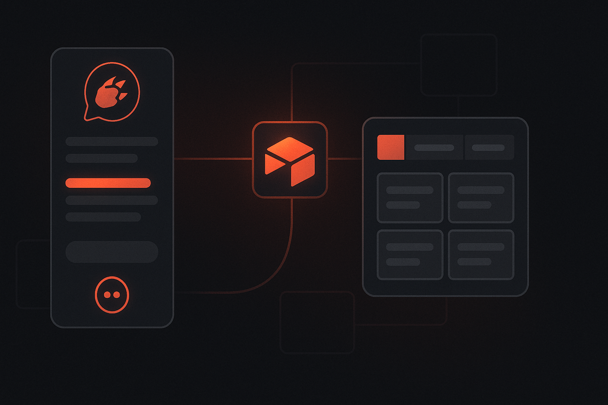

# How to Connect OpenClaw to Airtable Without Turning Yourself Into an Integration Janitor



*Structured data is where useful automation starts. The trick is getting your assistant to work with it without building a maintenance problem you’ll hate later.*

If you use **Airtable**, there’s a good chance it’s holding something important.

Maybe it’s your content pipeline. Maybe it’s sales data. Maybe it’s ops tracking, project records, customer lists, campaign status, or the kind of “temporary” internal system that quietly became business-critical six months ago.

And if you’re using **OpenClaw**, the obvious next step is giving it access to that data.

Because once an assistant can interact with structured records, it stops just sounding smart and starts becoming operationally useful.

The problem, as usual, is that “connect the assistant to Airtable” sounds far simpler than it really is.

By the time you do it manually, you’re usually elbow-deep in:

- auth setup
- credential storage
- provider-specific quirks
- retry logic
- request formatting
- future debugging you absolutely did not ask for

That’s the exact kind of mess **ClawLink** is meant to absorb.

With ClawLink, you can connect **OpenClaw to Airtable** in minutes and let your assistant work with structured data from chat, instead of turning yourself into unpaid middleware.

## Why connect OpenClaw to Airtable?

Because Airtable is often where the business actually keeps its living, editable system of record.

Once connected, OpenClaw becomes useful for things like:

- finding records quickly
- summarizing entries
- helping create or update rows
- pulling operational context into chat
- turning unstructured notes into structured data
- reducing manual copy-paste work across systems

That’s when the assistant becomes more than a nice interface. It becomes useful in the layer where your workflows actually live.

## The usual problem

A lot of “AI + Airtable” demos look clean because they skip the annoying part entirely.

What you actually end up dealing with is:

- auth and access setup
- credential handling
- provider-specific APIs
- execution plumbing
- retries and failures
- long-tail maintenance headaches

If your actual goal is just:

> “I want OpenClaw to work with Airtable.”

…then spending a bunch of time building that plumbing is usually the wrong trade.

## The easier way: use ClawLink

**ClawLink** is a third-party integration hub for OpenClaw.

It gives OpenClaw access to **100+ apps**, including Airtable, without forcing you to build and maintain the entire integration layer yourself.

### What ClawLink handles

- hosted connection flow
- credential storage
- provider auth maintenance
- request execution
- logs and reliability

### What you do

- install the plugin
- pair OpenClaw with ClawLink
- connect Airtable
- start using it from chat

That’s the whole idea: less plumbing, more actual outcomes.

## Step 1: Install the ClawLink plugin

Install the plugin in OpenClaw:

```bash
openclaw plugins install clawhub:clawlink-plugin
```

You can verify the project here:

- Website: https://claw-link.dev
- Docs: https://docs.claw-link.dev/openclaw
- Verification: https://claw-link.dev/verify
- Source: https://github.com/hith3sh/clawlink

## Step 2: Pair ClawLink with OpenClaw

After installing, ask OpenClaw to set up or pair ClawLink.

This launches the browser approval flow so your OpenClaw instance can securely connect to your ClawLink account.

That gives you a sane setup path instead of a pile of manual secrets and improvised integration glue.

If the plugin was just installed and the ClawLink tools are not visible yet, start a fresh OpenClaw chat and retry.

## Step 3: Connect Airtable in the ClawLink dashboard

Next, open the ClawLink dashboard and connect **Airtable**.

Approve access in your browser, and ClawLink handles the ugly provider-side details from there.

That means you do not need to manually manage:

- Airtable auth details
- credential storage
- token behavior
- Airtable-specific integration code

You connect it once. Then the assistant can start helping.

## Step 4: Use Airtable from OpenClaw chat

Once connected, you can start asking OpenClaw to help with Airtable tasks naturally.

Example prompts:

- “Find the record for Acme in Airtable”
- “Summarize the latest content pipeline entries”
- “Create a new Airtable record for this lead”
- “Turn these notes into a structured Airtable entry”
- “Pull the open tasks from Airtable and summarize blockers”

That’s the real win: your assistant gets access to structure, not just text.

## Why this is better than rolling your own

Could you wire Airtable directly into your own stack?

Of course.

But if your real goal is speed and usefulness, that’s often the wrong hill to die on.

Using ClawLink gives you a few immediate advantages.

### 1. Faster setup

You go from zero to useful much faster than hand-building the entire integration path.

### 2. Less maintenance

You avoid signing yourself up for provider-specific auth and execution edge cases later.

### 3. Better user experience

The connection happens through a normal browser flow, which is what users expect.

### 4. OpenClaw-first workflow

ClawLink is built to make **OpenClaw** more capable inside real business systems, not to make you maintain another brittle internal toolchain.

## Good starter use cases for OpenClaw + Airtable

### Sales and pipeline ops
Let OpenClaw search, summarize, or help update lead and account records.

### Content operations
Use Airtable as the structured layer behind content calendars and production workflows.

### Internal systems
Work with project trackers, issue logs, or business records that already live in Airtable.

### Data cleanup
Turn rough notes or messy updates into more structured record entries.

### Decision support
Ask OpenClaw to summarize what the current records actually say before you act.

## Security and trust

When AI touches structured business data, the obvious question is:

**How is access handled?**

ClawLink’s model is simple:

- provider credentials are stored encrypted at rest
- the user explicitly authorizes the connection
- OpenClaw uses ClawLink as the integration layer
- the goal is to make real integrations cleaner and safer, not more improvised

If Airtable is holding operational truth, trust matters quite a bit.

## Final thoughts

Connecting **OpenClaw to Airtable** should not require building a personal museum of auth workarounds and maintenance chores.

If your goal is to make your assistant useful in the place where structured work actually lives, the shortest path is:

1. install ClawLink  
2. pair it with OpenClaw  
3. connect Airtable  
4. start using it from chat

That’s it.

And yes, it really should be that simple.

## Try it

- Website: https://claw-link.dev
- Docs: https://docs.claw-link.dev/openclaw
- Verification: https://claw-link.dev/verify
- Plugin install: `openclaw plugins install clawhub:clawlink-plugin`

---

### Medium note

This article is intentionally written in a Medium-friendly format so it can be copied with minimal editing.
