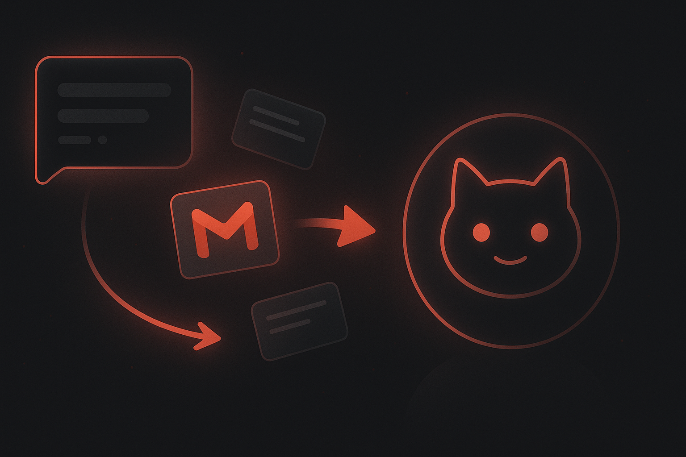

# How to Connect OpenClaw to Gmail and Stop Treating Email Like a Manual Job



*If your assistant can write beautifully but still can’t help with inbox work, it’s only solving the fun 20%.*

Email is still where an absurd amount of work happens.

Not the glamorous kind. The real kind.

Follow-ups. Replies. Scheduling friction. Customer questions. Internal coordination. Drafts that should have taken two minutes and somehow ate half an hour.

So if you’re using **OpenClaw**, one of the most practical upgrades you can make is giving it access to **Gmail**.

Because the difference between “AI that chats nicely” and “AI that actually helps” is usually whether it can interact with the tools where your day is already getting burned down.

The annoying part is that connecting an assistant to Gmail the traditional way usually means you end up in auth-land:

- OAuth setup
- token handling
- credential storage
- refresh logic
- provider-specific setup
- and the quiet promise that future-you will get to debug it later

That’s the exact kind of mess **ClawLink** is built to remove.

With ClawLink, you can connect **OpenClaw to Gmail** in minutes and let your assistant help with email workflows without building your own little integration headache.

## Why connect OpenClaw to Gmail?

Because inbox work is repetitive, expensive, and weirdly destructive to attention.

Once Gmail is connected, OpenClaw becomes useful for things like:

- drafting email replies
- pulling context from incoming messages
- helping summarize threads
- writing follow-ups from notes
- finding important emails faster
- reducing the copy-paste dance between inboxes and chat

Instead of being a detached assistant, it starts participating in real-world communication.

## The usual problem

A lot of integration advice makes this sound cleaner than it is.

What you usually inherit is:

- Google OAuth configuration
- access and refresh token handling
- secure storage concerns
- provider-specific API work
- retries and failure handling
- troubleshooting when something inevitably gets weird

If your actual goal is just:

> “I want OpenClaw to help me with Gmail.”

…then building all of that yourself is usually an expensive side quest in disguise.

## The easier way: use ClawLink

**ClawLink** is a third-party integration hub for OpenClaw.

It gives OpenClaw access to **100+ apps**, including Gmail, without forcing you to build and maintain every layer of the integration stack yourself.

### What ClawLink handles

- hosted connection flow
- credential storage
- provider auth maintenance
- request execution
- logs and reliability

### What you do

- install the plugin
- pair OpenClaw with ClawLink
- connect Gmail
- start using it from chat

Nice and boring. As it should be.

## Step 1: Install the ClawLink plugin

Install the plugin in OpenClaw:

```bash
openclaw plugins install clawhub:clawlink-plugin
```

You can verify the project and package here:

- Website: https://claw-link.dev
- Docs: https://docs.claw-link.dev/openclaw
- Verification: https://claw-link.dev/verify
- Source: https://github.com/hith3sh/clawlink

## Step 2: Pair ClawLink with OpenClaw

After installing, ask OpenClaw to set up or pair ClawLink.

This launches the browser-based approval flow so your OpenClaw instance can securely connect to your ClawLink account.

That gives you a proper setup path instead of passing around raw secrets or hacking together a one-off auth flow.

If the plugin was just installed and the tools are not visible yet, start a fresh OpenClaw chat and retry.

## Step 3: Connect Gmail in the ClawLink dashboard

Next, open the ClawLink dashboard and connect **Gmail**.

Approve access in the browser, and let ClawLink handle the ugly underlying parts.

That means you do not need to manually manage:

- Google auth details
- token refresh behavior
- credential storage
- Gmail-specific glue code

You connect once and get on with your day.

## Step 4: Use Gmail from OpenClaw chat

Once connected, you can start asking OpenClaw to help with Gmail tasks in plain language.

Example prompts:

- “Draft a reply to the latest email from Sarah”
- “Summarize my unread emails from today”
- “Find the thread about the pricing discussion”
- “Write a follow-up email based on these meeting notes”
- “Help me respond to this customer email clearly and politely”

That’s the actual benefit: not more infrastructure, just less friction.

## Why this is better than rolling your own

Could you build the Gmail integration path yourself?

Sure.

Should you, if your actual goal is just to make OpenClaw useful?

Usually not.

Here’s what ClawLink buys you.

### 1. Faster time to value

You can get from zero to useful much faster than building and maintaining custom email plumbing.

### 2. Less maintenance debt

You don’t become the person responsible for Gmail auth edge cases forever.

### 3. Better UX

The connection happens in the browser, which is where users already expect email app approvals to happen.

### 4. OpenClaw-first experience

ClawLink is designed around the idea that external tools should make **OpenClaw** better — not create another engineering hobby project.

## Good starter use cases for OpenClaw + Gmail

### Inbox triage
Let OpenClaw summarize, prioritize, or help process what matters first.

### Reply drafting
Use OpenClaw to write cleaner, faster replies from rough notes or intent.

### Follow-ups
Turn meeting notes or pending tasks into draft follow-up emails.

### Search and context
Find relevant messages and use them as context for the next action.

### Customer communication support
Draft thoughtful replies without starting from a blank page every time.

## Security and trust

When a product touches email, the trust question is not optional.

**It should be asked.**

ClawLink’s model is straightforward:

- provider credentials are stored encrypted at rest
- the user explicitly authorizes the connection
- OpenClaw uses ClawLink as the integration layer
- the goal is safer, cleaner access to external tools — not a sketchy workaround

If you’re connecting AI to real communication systems, trust is part of the product.

## Final thoughts

Connecting **OpenClaw to Gmail** shouldn’t require standing up your own auth machinery just to save time on email.

If your goal is to make your assistant useful in the place where work keeps arriving, the shortest path is:

1. install ClawLink  
2. pair it with OpenClaw  
3. connect Gmail  
4. start using it from chat

That’s it.

And frankly, inbox work is annoying enough already. No need to add infrastructure cosplay on top of it.

## Try it

- Website: https://claw-link.dev
- Docs: https://docs.claw-link.dev/openclaw
- Verification: https://claw-link.dev/verify
- Plugin install: `openclaw plugins install clawhub:clawlink-plugin`

---

### Medium note

This article is intentionally written in a Medium-friendly format so it can be copied with minimal editing.
