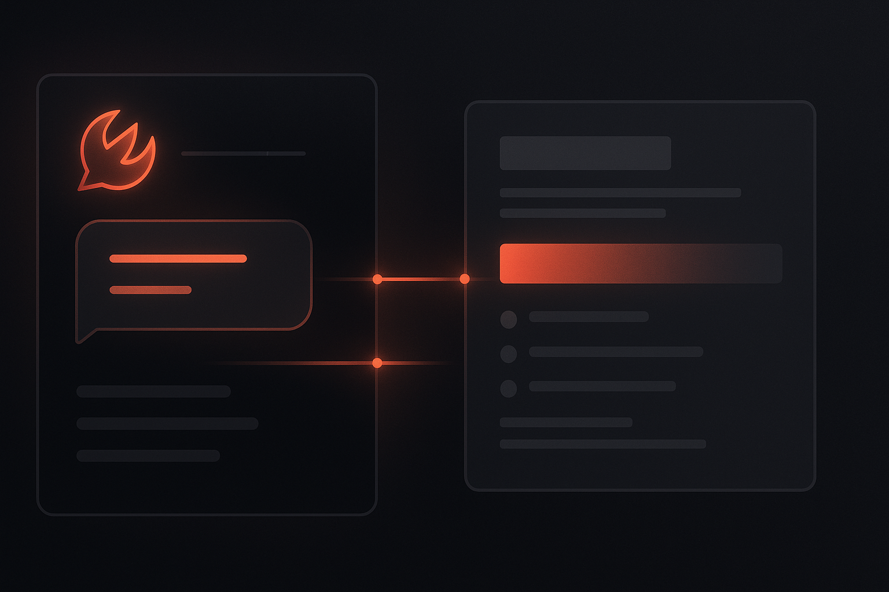

# How to Connect OpenClaw to Notion Without Building Yet Another Glue Layer



*Your assistant should be able to read docs, pull context, and help create pages — not sit there looking smart while you manually shuttle information in and out of Notion.*

There’s a specific kind of disappointment that happens when an AI assistant feels clever in chat but useless the second real work begins.

Because the real work is usually not in the chat window.

It’s in **Notion**.

Your specs. Your notes. Your research. Your half-organized plans. The internal knowledge your team keeps saying is “all in there somewhere.”

And if OpenClaw can’t work with that context, then a lot of its intelligence is stuck outside the room.

That’s where the usual integration pain begins.

Connecting an AI assistant to Notion the traditional way tends to become a side quest involving authentication, token handling, provider setup, and future maintenance that you absolutely did not volunteer for. If you’re technical, you *can* build it all yourself — but that doesn’t mean you should.

That’s exactly the mess **ClawLink** is designed to remove.

With ClawLink, you can connect **Notion to OpenClaw** in minutes and use it from chat like a sane person — not like someone maintaining a growing pile of auth plumbing.

## Why connect OpenClaw to Notion?

Because this is where a lot of the useful context is already hiding:

- meeting notes
- product specs
- project docs
- customer research
- task databases
- content plans
- internal knowledge

Once OpenClaw can work with that workspace, it becomes dramatically more useful.

Instead of being a generic chatbot floating above your actual work, it can help with things like:

- “Search Notion for our onboarding notes”
- “Find the page about the Q2 roadmap”
- “Create a draft page for this feature idea”
- “Pull together customer research notes into a summary”
- “Use my Notion docs to help write a blog post”

That’s the real upgrade: **your assistant starts working with your stack instead of orbiting around it like a very articulate outsider.**

## The usual problem

Connecting AI agents to business tools sounds wonderfully simple right up until you actually try to do it cleanly.

Normally, you end up dealing with:

- OAuth setup
- token refresh logic
- secure credential storage
- provider-specific APIs
- retries and failure handling
- debugging odd edge cases later

If your actual goal is just:

> “I want OpenClaw to use Notion.”

…then building all of that yourself is usually an expensive detour wearing a fake mustache labeled “flexibility.”

## The easier way: use ClawLink

**ClawLink** is a third-party integration hub for OpenClaw.

It gives OpenClaw access to **100+ apps** — including Notion — without forcing you to build and maintain all the auth and integration plumbing yourself.

### What ClawLink handles

- hosted connection flow
- credential storage
- provider auth maintenance
- tool execution
- logs and reliability

### What you do

- install the plugin
- pair your OpenClaw device
- connect Notion
- start using it from chat

That’s the whole game.

## Step 1: Install the ClawLink plugin

Install the plugin in OpenClaw:

```bash
openclaw plugins install clawhub:clawlink-plugin
```

You can also verify the package and source before installing:

- Website: https://claw-link.dev
- Docs: https://docs.claw-link.dev/openclaw
- Verification: https://claw-link.dev/verify
- Source: https://github.com/hith3sh/clawlink

## Step 2: Pair ClawLink with OpenClaw

After installing, ask OpenClaw to set up or pair ClawLink.

This starts the pairing flow so your OpenClaw instance can securely connect to your ClawLink account. You approve the device in your browser, and OpenClaw stores the resulting local credential for future use.

This matters because it avoids the ugly alternative of manually pasting raw keys around or building your own ad hoc setup flow.

If the plugin was just installed and the tools are not visible yet, start a fresh OpenClaw chat and try again.

## Step 3: Connect Notion in the ClawLink dashboard

Next, open the ClawLink dashboard and connect **Notion**.

Approve access in your browser. Once connected, ClawLink handles the messy bits behind the scenes.

That means you do **not** need to manually manage:

- Notion auth details
- token refresh
- credential storage
- provider-specific glue code

You connect it once and move on with your life, which is how software should behave more often.

## Step 4: Use Notion from OpenClaw chat

Once connected, you can start asking OpenClaw to do useful things with Notion.

Example prompts:

- “Search Notion for onboarding notes”
- “Find the page about our Q2 roadmap”
- “Create a new Notion page called Feature Ideas”
- “Summarize my Notion notes about customer interviews”
- “Pull the relevant notes from Notion and help me write a draft”

That’s the nice part: you don’t need to think in API calls, request bodies, or auth edge cases.

You just ask naturally.

## Why this setup is better than rolling your own

There’s always a temptation to build direct integrations manually, especially if you’re technical and one bad idea away from opening a new repo.

Sometimes that’s the right call.

But for most OpenClaw users, the more honest question is:

> Do I want to maintain auth infrastructure, or do I want my assistant to work?

Using ClawLink gives you a few obvious advantages.

### 1. Faster setup

You can get from zero to working far faster than building a custom Notion integration path.

### 2. Less maintenance

You’re not on the hook for babysitting provider auth logic and refresh behavior like it’s now your emotional support infrastructure.

### 3. Better user experience

The connect flow happens in the browser, which is how normal people expect integrations to work.

### 4. OpenClaw-first workflow

ClawLink is built around the idea that you want to use external tools **from OpenClaw**, not stitch together a generic agent stack from scratch.

## Good starter use cases for OpenClaw + Notion

Here are a few practical ways to start.

### Research assistant
Ask OpenClaw to search Notion for relevant notes, then summarize what matters.

### Writing assistant
Pull context from existing docs and use it to draft blog posts, specs, or proposals.

### Knowledge retrieval
Find older documents without manually digging through a messy workspace.

### Internal operations
Use Notion pages and databases as a source of truth for structured team information.

### Project support
Let OpenClaw reference planning docs, notes, and internal pages while helping with day-to-day execution.

## Security and trust

Whenever someone hears “connect your assistant to Notion,” the next question is obvious:

**Is this safe?**

ClawLink’s model is straightforward:

- provider credentials are stored encrypted at rest
- connections are explicitly authorized by the user
- OpenClaw uses ClawLink as the integration layer
- the goal is to make real tool access easier without making the setup sketchy

If you’re giving AI access to real work systems, trust matters a lot. This is not the place for sketchy glue code and crossed fingers.

## Final thoughts

Connecting **OpenClaw to Notion** should not require building an integration platform from scratch.

If your goal is to make your assistant more useful inside the tools you already use, the shortest path is:

1. install ClawLink  
2. pair it with OpenClaw  
3. connect Notion  
4. start using it from chat

That’s it.

If you already use OpenClaw and want your assistant to work with real business tools instead of living in a vacuum, this is one of the highest-leverage upgrades you can make.

## Try it

- Website: https://claw-link.dev
- Docs: https://docs.claw-link.dev/openclaw
- Verification: https://claw-link.dev/verify
- Plugin install: `openclaw plugins install clawhub:clawlink-plugin`

---

### Medium note

This article is intentionally written in a Medium-friendly format so it can be copied with minimal editing.
