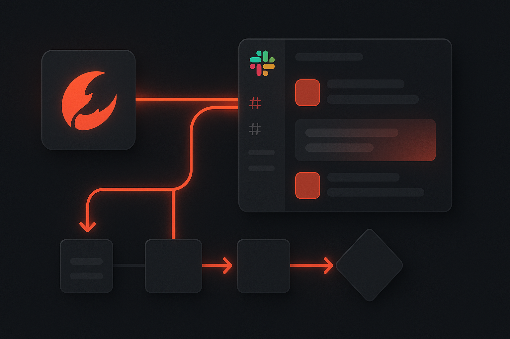

# How to Connect OpenClaw to Slack Without Building a Tiny Integration Nightmare



*Your assistant should be able to send a message, read the room, and help with real work — without you spending a weekend wiring OAuth, webhooks, and retries by hand.*

There’s a very predictable moment every OpenClaw user hits.

At first, the assistant feels smart. Then you realize it’s still trapped in a little glass box unless it can reach the tools your team actually uses.

And one of the first tools people want is **Slack**.

Because that’s where the real work happens:

- internal coordination
- status updates
- support triage
- alerts
- team chatter
- approvals
- “hey can someone handle this?” chaos

The problem is that connecting an AI assistant to Slack sounds simple until you actually try to do it cleanly.

Then suddenly you’re dealing with app setup, scopes, auth, credential storage, token refresh, execution plumbing, and the delightful possibility of debugging all of it later.

That’s exactly the kind of nonsense **ClawLink** is built to remove.

With ClawLink, you can connect **OpenClaw to Slack** in minutes and let your assistant interact with Slack the normal way: through chat, not through an ever-growing pile of integration code.

## Why connect OpenClaw to Slack?

Because if OpenClaw can’t reach your team’s communication layer, it’s missing half the point.

Once Slack is connected, your assistant becomes useful for things like:

- sending updates into a channel
- drafting or posting internal announcements
- pulling context from Slack conversations
- helping coordinate ops workflows
- surfacing information into team chat faster
- reducing the copy-paste tax between AI and communication tools

In other words, it stops being a toy and starts acting more like an actual assistant.

## The usual mess

Most “just connect Slack” advice quietly skips over the ugly bits.

What you usually end up managing is:

- Slack app configuration
- scopes and permissions
- OAuth setup
- secure credential handling
- token lifecycle issues
- retries when API calls fail
- logs when something goes wrong

If your actual goal is just:

> “I want OpenClaw to talk to Slack.”

…then building a mini platform around that goal is not exactly a victory.

## The easier path: ClawLink

**ClawLink** is a third-party integration hub for OpenClaw.

It gives OpenClaw access to **100+ apps**, including Slack, through a setup flow that is much closer to how humans expect integrations to work.

### What ClawLink handles

- the hosted connection flow
- credential storage
- auth maintenance
- request execution
- logs and reliability

### What you do

- install the plugin
- pair OpenClaw with ClawLink
- connect Slack
- start using it from chat

That’s the whole thing. No hand-built duct tape required.

## Step 1: Install the ClawLink plugin

Install the plugin in OpenClaw:

```bash
openclaw plugins install clawhub:clawlink-plugin
```

Before installing, you can verify the project here:

- Website: https://claw-link.dev
- Docs: https://docs.claw-link.dev/openclaw
- Verification: https://claw-link.dev/verify
- Source: https://github.com/hith3sh/clawlink

## Step 2: Pair ClawLink with OpenClaw

After installing, ask OpenClaw to set up or pair ClawLink.

This launches the browser-based approval flow so your OpenClaw instance can securely link to your ClawLink account.

That gives you a proper setup path instead of the sketchier alternative of manually juggling raw credentials.

If the plugin was just installed and the ClawLink tools do not appear yet, start a fresh OpenClaw chat and retry.

## Step 3: Connect Slack in the ClawLink dashboard

Next, open the ClawLink dashboard and connect **Slack**.

Approve the connection in your browser and let ClawLink handle the provider-side mess from there.

That means you do not need to manually babysit:

- Slack OAuth details
- token refresh behavior
- credential storage
- provider-specific glue code

You connect once. Then you get back to doing actual work.

## Step 4: Use Slack from OpenClaw chat

Once connected, you can start asking OpenClaw to help with Slack tasks naturally.

Example prompts:

- “Send a message to #general with today’s deployment update”
- “Post this summary into the product channel”
- “Find the latest discussion about onboarding issues”
- “Help me draft a Slack update from these notes”
- “Take this result and send it to the ops team in Slack”

The nice part is that you don’t need to think in endpoints or payloads.

You just ask like a person.

## Why this beats rolling your own

If you’re technical, it’s easy to tell yourself you’ll just wire Slack directly.

And sure, you *can*.

But the better question is:

> Do you want to build auth and reliability infrastructure, or do you want OpenClaw to be useful this week?

Using ClawLink gives you a few immediate wins.

### 1. Faster setup

You move from idea to working integration much faster.

### 2. Less maintenance

You don’t end up babysitting Slack-specific auth and execution plumbing.

### 3. Better UX

The connect flow happens in a browser, which is how people already expect app connections to work.

### 4. OpenClaw-first workflow

ClawLink is meant to make **OpenClaw** more capable, not turn you into the unpaid maintainer of another internal integration stack.

## Good starter use cases for OpenClaw + Slack

### Team updates
Let OpenClaw turn rough notes into clean status updates and post them where the team already works.

### Support coordination
Use OpenClaw to help route or summarize support issues before sending them into Slack.

### Ops communication
Push alerts, summaries, or action items into the right team channels quickly.

### Internal assistant workflows
Use Slack as the place where OpenClaw delivers useful outputs instead of making people switch tools constantly.

### Drafting and cleanup
Have OpenClaw rewrite messy notes into clear internal messages before sending them.

## Security and trust

Whenever a tool wants access to team communication, people ask the right question:

**Is this going to be sketchy?**

ClawLink’s approach is straightforward:

- provider credentials are stored encrypted at rest
- the user explicitly authorizes the connection
- OpenClaw uses ClawLink as the integration layer
- the goal is to make real tool access cleaner, not riskier

That trust layer matters a lot when you’re connecting real workplace systems.

## Final thoughts

Connecting **OpenClaw to Slack** should not require turning yourself into a part-time integration engineer.

If your goal is to make your assistant useful where your team already communicates, the shortest path is:

1. install ClawLink  
2. pair it with OpenClaw  
3. connect Slack  
4. start using it from chat

That’s it.

And honestly, that’s how it should have worked in the first place.

## Try it

- Website: https://claw-link.dev
- Docs: https://docs.claw-link.dev/openclaw
- Verification: https://claw-link.dev/verify
- Plugin install: `openclaw plugins install clawhub:clawlink-plugin`

---

### Medium note

This article is intentionally written in a Medium-friendly format so it can be copied with minimal editing.
